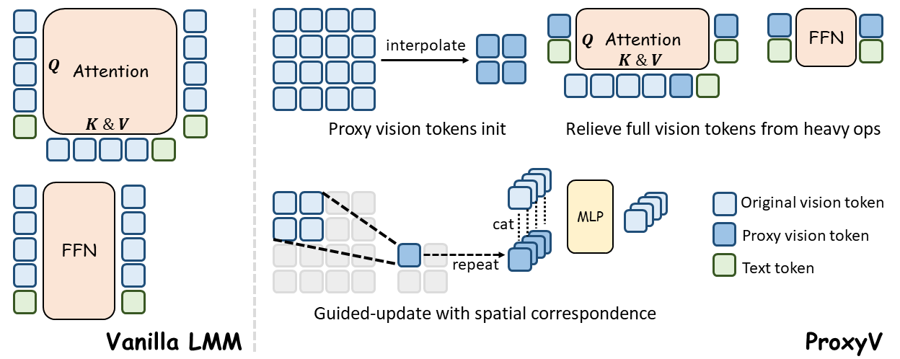

# ProxyV: Streamline Without Sacrifice - Squeeze out Computation Redundancy in LMM

[]()
[](https://penghao-wu.github.io/ProxyV/)
[]()



## Contents:
1. [Getting Started](#start)
2. [Image Encoding Scheme](#encoding)
3. [Training](#training)
4. [Evaluation](#evaluation)
5. [License](#license)
6. [Citation](#citation)
7. [Acknowledgement](#acknowledgement)

## Getting Started <a name="start"></a>

### Installation
```
conda create -n proxyv python=3.10 -y
conda activate proxyv
pip install --upgrade pip  # Enable PEP 660 support.
pip install -e ".[train]"
```

### Training Dataset
For the pre-training stage, we use the 1.2M ShareGPT4V data which can be downloaded at this [link](https://huggingface.co/datasets/Lin-Chen/ShareGPT4V)
For the fine-tuning stage, we use the public LLaVA-Next data which can be downloaded at this [link](https://huggingface.co/datasets/lmms-lab/LLaVA-NeXT-Data)

## Image Encoding Scheme <a name="encoding"></a>
In our current implementation, we adopt the [AnyRes](https://github.com/LLaVA-VL/LLaVA-NeXT) strategy. The image features within each crop are flattened in raster order and concatenated crop by crop, similar to the [UniRes](https://github.com/EvolvingLMMs-Lab/LongVA) strategy. We also append a newline separator token after each crop.  
To process the vision tokens more conveniently, we pack tokens in the **\[vision tokens; proxy tokens; newline separator tokens; text tokens\]** order, and modify the position_ids and attention_masks accordingly to preserve their original relative order.

## Training <a name="training"></a>
The pre-training scripts can be found within the ``scripts/pretrain`` folder, and fine-tuning example scripts are provided under the ``scripts/finetune`` folder.  
To enable ProxyV, set ``--proxyv`` to ``true`` in the script and set ``--proxyv_start_layer`` to the desired layer index.

## Evaluation <a name="evaluation"></a>
The vicuna-1.5-7B ProxyV layer-12 model studied in the paper is provided at this [link](vicuna-1.5-7B ProxyV layer-12 model). 
A simple inference example script is provided at ``demo.py``.  
All benchmark evaluations can be directly conducted using [lmms-eval](https://github.com/EvolvingLMMs-Lab/lmms-eval) with `--model` set to `llava`.

## License <a name="license"></a>

This project is under the Apache-2.0 license. See [LICENSE](LICENSE) for details.

## Citation <a name="citation"></a>
Please consider citing our paper if you find this project helpful for your research:

```bibtex
@article{proxyv,

}
```

## Acknowledgement <a name="acknowledgement"></a>
-  This work is built upon [LLaVA-NeXT](https://github.com/LLaVA-VL/LLaVA-NeXT). 

